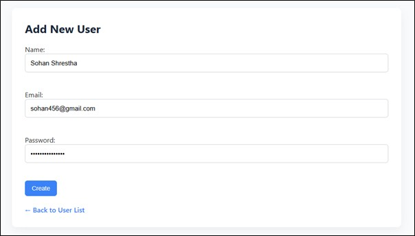
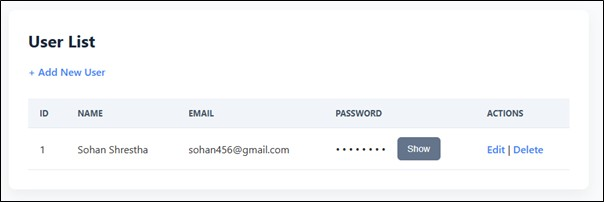
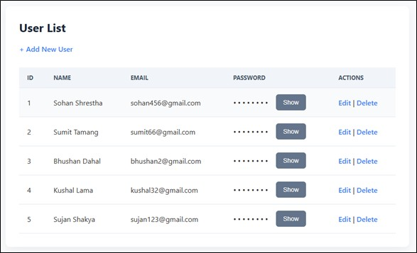
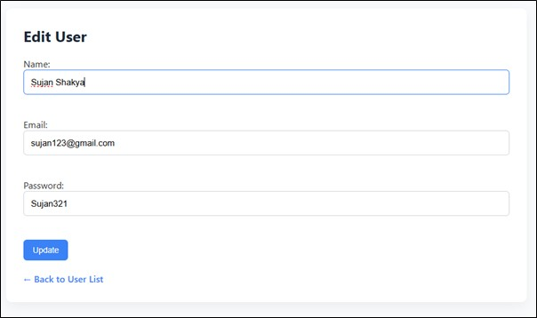
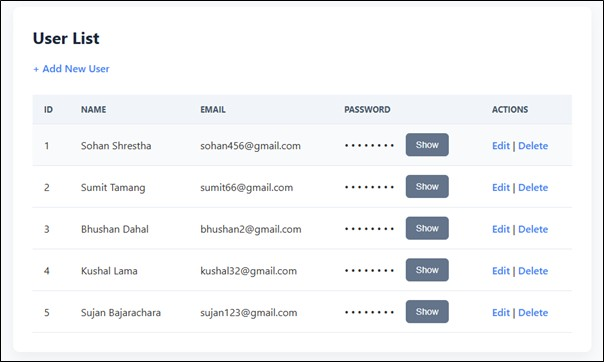
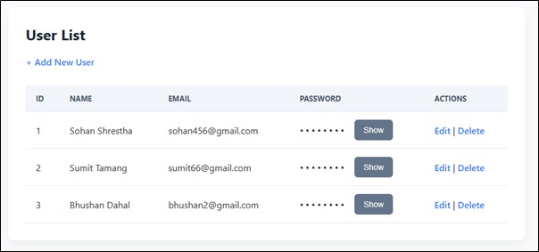

# 🛠️ Simple PHP MySQL CRUD Application


A basic **CRUD (Create, Read, Update, Delete)** web application built using **PHP** and **MySQL**. This lightweight project demonstrates how to handle user data in a database through an easy-to-use web interface.

---

## ✨ Features

- 📋 View a list of all users in a styled table  
- ➕ Add new users with name, email, and password  
- 🛠️ Edit existing user records  
- 🗑️ Delete users from the database  
- 🔐 Password toggle (hide/show for user privacy)  
- 💻 Fully responsive interface  
- 🎨 Clean and modern UI (via `style.css`)  
- 🔗 Modular code with reusable database connection  

---

## 🧰 Technologies Used

| Technology | Purpose             |
|------------|---------------------|
| PHP        | Backend logic       |
| MySQL      | Database management |
| HTML & CSS | Frontend design     |

---


## 🗂️ File Structure

```
/crud-php/
│
├── index.php          # Displays all users and actions
├── create.php         # Form to add a new user
├── edit.php           # Form to edit user details
├── delete.php         # Deletes a user
├── createTable.php    # Creates the user table
├── db.php             # Database connection settings
├── style.css          # Application styling
├── screenshot         # Screenshot foder
└── README.md          # Project documentation
```

---

## 🧱 Database Schema

Here's the SQL used in `createTable.php`:

```sql
CREATE TABLE user (
  id INT(11) AUTO_INCREMENT PRIMARY KEY,
  name VARCHAR(100) NOT NULL,
  email VARCHAR(100) NOT NULL,
  password VARCHAR(255) NOT NULL
);
```

---

## 🚀 Getting Started

### Prerequisites

- 🐘 **PHP** (v7 or later)
- 🛢️ **MySQL/MariaDB**
- 🖥️ **Web server** (Apache, Nginx, or use XAMPP/LAMP/WAMP stack)

### Installation

1. **Clone the repo:**
   ```bash
   git clone https://github.com/yourusername/crud-php-mysql.git
   ```

2. **Set up the database:**
   - Create a MySQL database named `mydb`
   - Run `createTable.php` to generate the user table

3. **Update database credentials:**
   Edit `db.php` to match your MySQL credentials:
   ```php
   <?php
    $conn = mysqli_connect("localhost", "root", "", "mydb");
    if (!$conn) {
    die("Connection failed: " . mysqli_connect_error());
    }
    ?>
   ```

4. **Run the app:**
   Open `index.php` in your browser:
   ```
   http://localhost/crud-php/index.php
   ```

---

## 🔧 Customization Tips

- ✅ Hash passwords before saving:
```php
$hashedPassword = password_hash($password, PASSWORD_DEFAULT);
```

- 🔐 Use prepared statements (mysqli) to prevent SQL injection:
```php
// Example: Insert user safely
$stmt = $conn->prepare("INSERT INTO user (name, email, password) VALUES (?, ?, ?)");
$stmt->bind_param("sss", $name, $email, $hashedPassword);
$stmt->execute();
$stmt->close();
```

- 🌐 Add client/server-side validation (e.g., required fields, email format)
- 🧑 Add more fields: phone number, profile picture (file uploads), roles, etc.
- 📦 Use sessions to build a login system or admin-only access
- 🎨 Tweak `style.css` for branding or theme changes

---

## 💡 Real-World Use Cases

This project can be adapted for:

- 🧑‍💼 **Employee/User Management Dashboard**
- 📝 **Student Record System**
- 🏫 **School/College Registration System**
- 💾 **Backend prototype for small web applications**

---

## 📸 Screenshots

- Create Operation
    - Before submission

    Figure 1: Form filled with Name, Email, and Password
  
    

    - After Submission

    Figure 2: Table showing the new user added
  
    

- Read Operation

Figure 3: Table displaying all users fetched from the database



- Updaye Operation
    - Before update

    Figure 4: Edit form with current user details pre-filled
  
    

    - After Update

    Figure 5: Table showing updated user details
  
    

- Delete Operation
    - Before Delete

    Figure 6: Table showing user before deletion
  
    

    - After Submission

    Figure 7: Table showing the user removed from the database
  
    


---

## ⚠️ Security Notes

**This project is intended for educational use only.**

| Issue | Recommendation |
|-------|----------------|
| 🔓 Plain Text Passwords | Use `password_hash()` and `password_verify()` |
| ⚠️ No SQL Protection | Use prepared statements |
| 🛡️ No Validation | Add server/client-side validation |

---

## 🔄 Changelog

| Version | Date | Changes |
|---------|------|---------|
| 1.0 | 2025-08-25 | Initial release with full CRUD and responsive UI |

---

## 🧑‍💻 Author

**Suresh Shrestha**  
GitHub: [Suresh Shrestha](https://github.com/Suresh-Shrestha1)  

---
